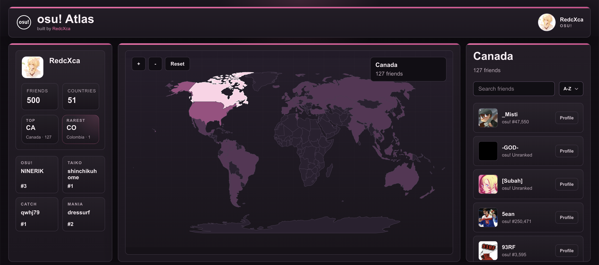

# [osu!](https://osu.ppy.sh) Atlas

I go to a lot of osu! meetups, and I always end up wondering where all my friends are actually from. So I made this — it throws your entire friend list onto a world map so you can see at a glance who's where.

## What it does

- Sign in with your osu! account (no extra setup)
- Pulls your friend list and groups everyone by country
- Interactive world map — hover for the count, click to see who's there
- Side panel for stats, search, and filters

## Why

I wanted to know which meetups I'd actually have friends at before showing up. A flat friend list doesn't really tell you that, but a map does.

